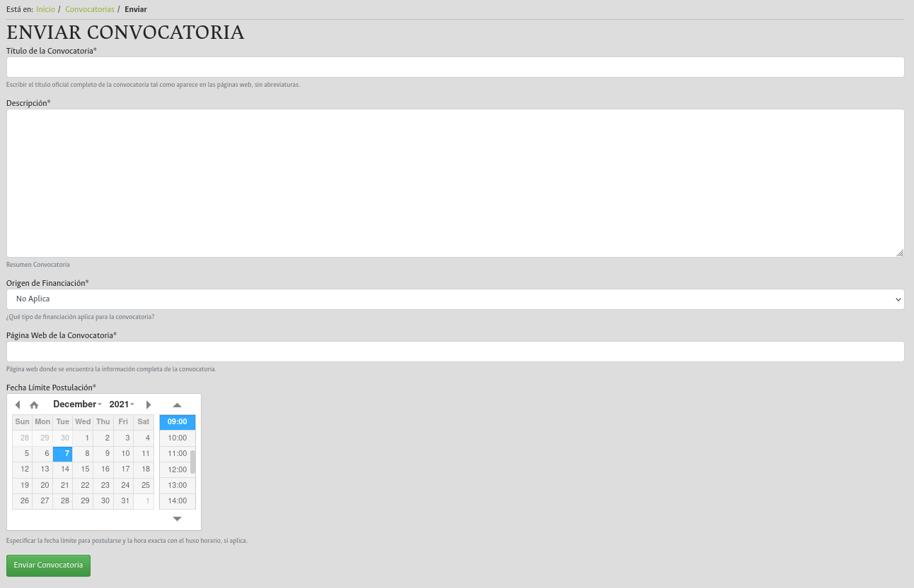

MANUAL DE USUARIO FINAL
=======================

Directorio de Convocatorias
---------------------------

Es la funcionalidad central del aplicativo, una vez instalado y configurado, se puede acceder a ella desde el enlace `CONVOCATORIAS <https://unal-dnil.herokuapp.com/>`_ de la `página oficial de investigaciones <https://investigacion.unal.edu.co/>`_:

.. image:: img/inicio.png
   :scale: 50 %   
   :alt: Inicio.

Entrando a la sección de CONVOCATORIAS, aparece el directorio público de convocatorias. El buscador de la parte superior, los filtros de la parte izquierda, la paginación, permiten la búsqueda y navegación sobre el conjunto de registros presentados.

La parte superior derecha presenta algunos indicadores acerca de los registros publicados (número de convocatorias, cuantas de ellas están vigentes y la suma **automática** de los montos potenciales de financiación de aquellas que incluyen algún tipo de financiación):

La parte superior presenta dos componentes relacionados con contenidos relevantes para el directorio: banners informativos y los botones de enlaces principales (Instructivo de Convocatorias, PIVOT, HORUS, Calendario), estos se configuran desde el panel administrativo:

Cada de una de las convocatorias es presentada por medio de unas tarjetas informativas, que incluyen la caracterización básica de las mismas: Título, Categoría, Fecha de Publicación, Fecha Límite de Aplicación, Estado de la Convocatoria (Vigente/Cerrada, cambiando el ícono según el caso), Palabras Claves Asociadas, Posible Monto de Financiación (no todas las convocatorias incluyen esta cifra). 

Las convocatorias que ya no están vigentes, se mantienen en directorio por registros históricos. Estas se distinguen por la imagen grís de referencia y el ícono rojo de calendario:

Al seleccionar cualquiera de las fichas publicadas, haciendo click sobre el título o en el botón "ver más", se abre la convocatoria específica y muestra toda la información asociada a la misma. Se incluyen tres enlaces de apoyo: Registre su proyecto en HERMES (redirige al Sistema HERMES, Más Información (consultar la página de aplicación de la convocatoria, Volver (volver al directorio):

Formulario Público de Envío
~~~~~~~~~~~~~~~~~~~~~~~~~~~

El directorio de convocatorias, en la parte inferior izquierda, incluye un enlace a un formulario público, que tiene como objetivo, permitir que la comunidad académica envíe para publicación nuevas convocatorias que ellos han detectado:

El formulario registra los campos básicos de una convocatoria: Título, Origen de la Finaciación (Interna, Externa Nacional, Externa Internacional, N/A), Página Web de Referncia, Fecha Límite de publicación:

Desde luego el registro enviado por este medio, NO queda automáticamente publicado, el aparecerá listado en privado para que los gestores puedan hacer la curaduría correspondiente, para su publicación, en caso de ser pertinente.