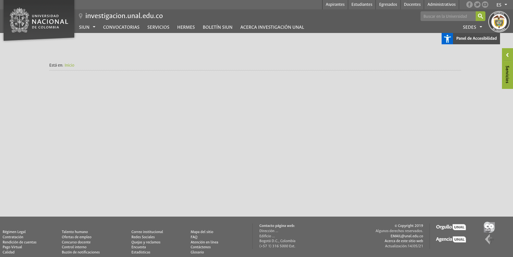

MANUAL DE USUARIO FINAL
=======================

.. _seccionPub:

Directorio de Convocatorias
---------------------------

Es la funcionalidad central del aplicativo, una vez instalado y configurado, se puede acceder a ella desde el enlace `CONVOCATORIAS <https://unal-dnil.herokuapp.com/><_blank>`_ de la `página oficial de investigaciones <https://investigacion.unal.edu.co/><_blank>`_:

Formulario Público de Envío
~~~~~~~~~~~~~~~~~~~~~~~~~~~

adsf adsf asdf asdf asdf adfasdñklfjadjskfhlakdfkjh a kajdsfl kjhasd lkjasdf lh adsf 
adsf asdf asdf asdf adfasdñklfjadjskfhlakdfkjh a kajdsfl kjhasd lkjasdf lh

Panel Administrativo
--------------------

adsf adsf asdf asdf asdf adfasdñklfjadjskfhlakdfkjh a kajdsfl kjhasd lkjasdf lh adsf 
adsf asdf asdf asdf adfasdñklfjadjskfhlakdfkjh a kajdsfl kjhasd lkjasdf lh

.. code-block:: console

   (.venv) $ pip install lumache

adsf adsf asdf asdf asdf adfasdñklfjadjskfhlakdfkjh a kajdsfl kjhasd lkjasdf lh adsf 
adsf asdf asdf asdf adfasdñklfjadjskfhlakdfkjh a kajdsfl kjhasd lkjasdf lh