PANEL ADMINISTRATIVO GESTORES
=============================

Acceso al panel administrativo
------------------------------
El Módulo Web de Convocatorias incluye un panel administrativo, en la versión actual puede accederse desde `este enlace <https://unal-dnil.herokuapp.com/admin/>`_:

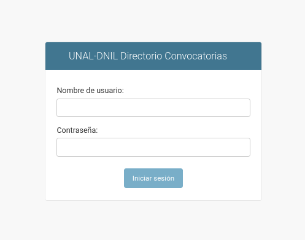

Roles de Usuario
----------------
Este panel incluye dos roles administrativos, uno orientado a Gestión y otro orientado a la operación cotidiana de publicación de convocatorias. 

Gestor
~~~~~~
Es el rol básico operativo, orientado simplemente a la revisión, registro, actualización de convocatorias. No tiene habilitadas funcionalides de configuración del directorio:

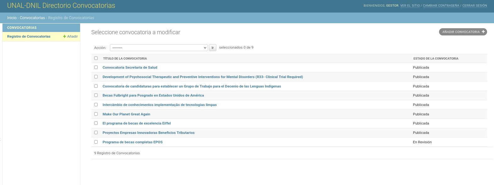

Administrador
~~~~~~~~~~~~~
Es el rol de usuario que tiene acceso a la configuración de todas las funcionalidades del directorio. Puede crear nuevas categorías de las caracterizaciones de las convocatorias (Entidades, Componentes, Áreas OCDE), incluyendo desde luego las funcionalidades del rol de Gestor y la configuración de los enlaces de apoyo del directorio (Banners y Botones).

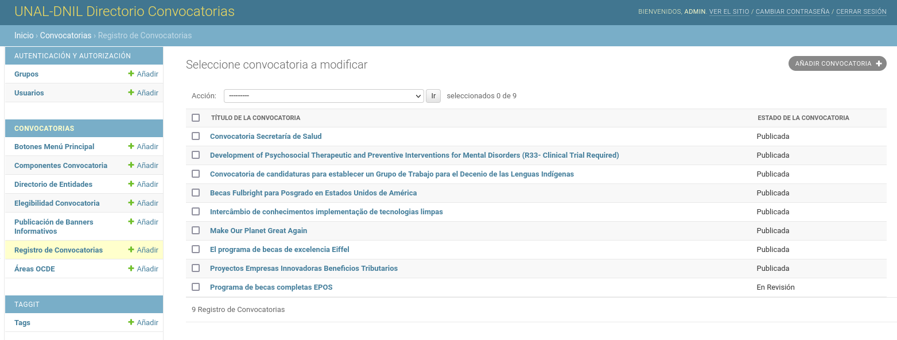

Directorio de Entidades
-----------------------
La premisa base del funcionamiento del directorio, es que NO existen convocatorias huérfanas, toda convocatoria registrada proviene de la gestión misional de una Entidad en específico. Estas organismos se registran entonces un pequeño directorio:

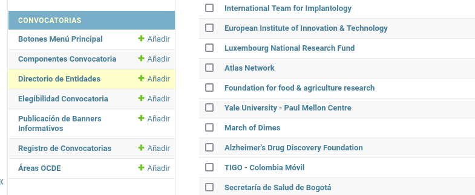

La idea es asociar el país al cual pertenece la entidad otorgante de la convocatoria, manteniendo actualizado los datos de contacto o de referencia de cada organización. Esta entidad se seleccionará al publicar una convocatoria:

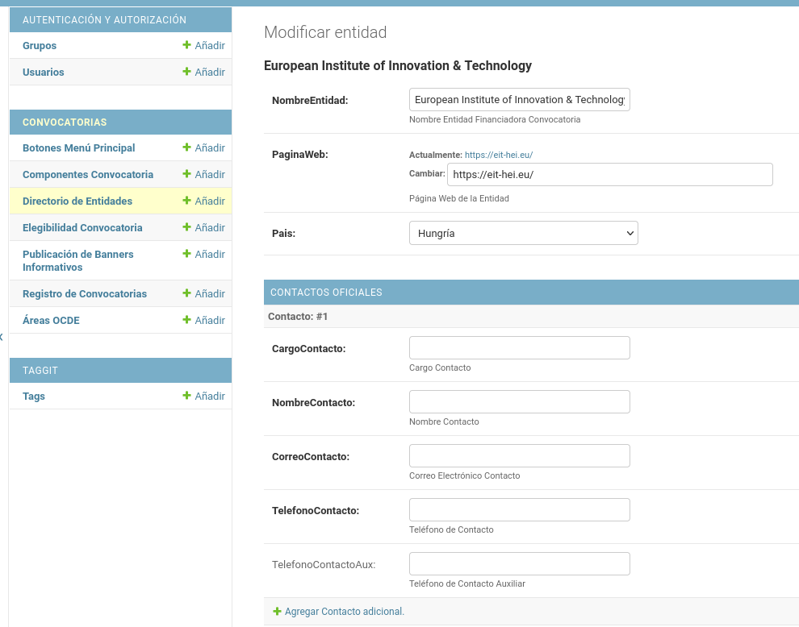

Componentes Convocatoria
------------------------
Permite configurar las categorias asociadas a los propósitos que se buscan lograr mediante la convocatoria (Investigación, Emprendimiento, Prototipado, etc.). Cáda una de estas categorías tiene asociada una imagen de cabecera que se utiliza en la ficha de presentación de las convocatorias y en su presentación en redes sociales. Esta imagen puede ser actualizada por el Gestor en cualquier momento.

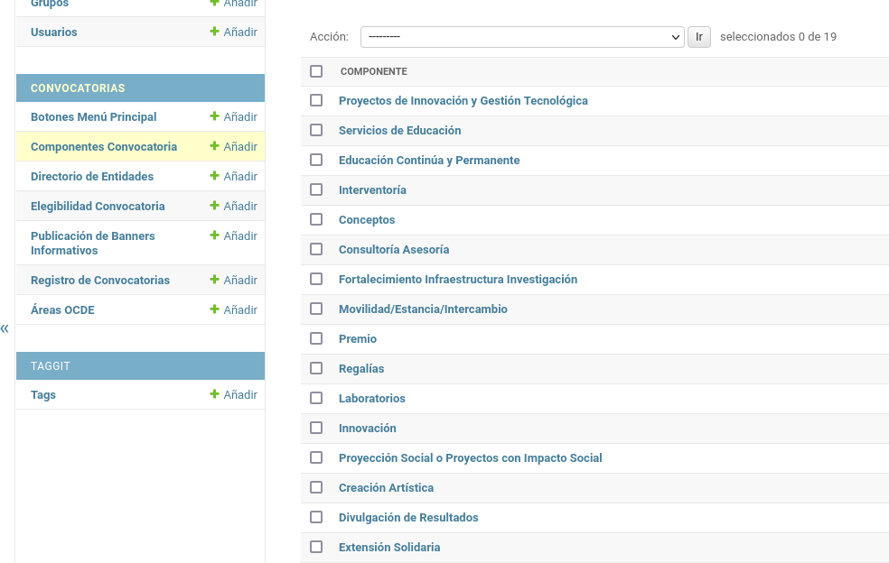

Elegibilidad Convocatoria
-------------------------
Se configuran aquí las categorias poblacionales, hacia quienes se encuentra orientada la convocatoria:

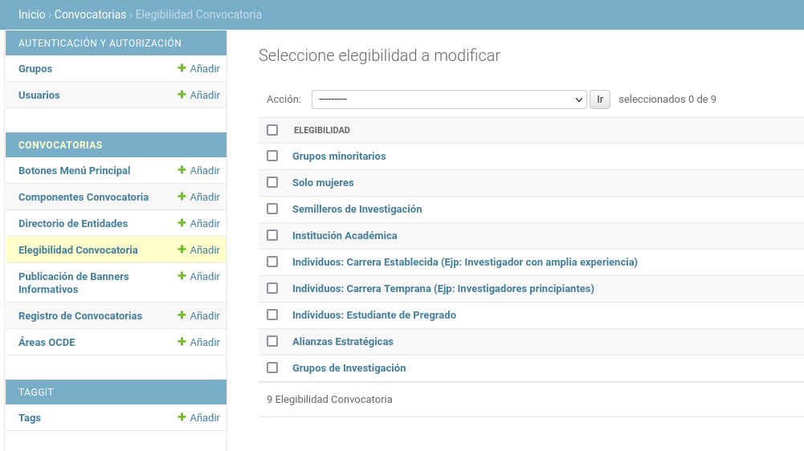

Áreas OCDE
----------
Se configuran aquí las áreas relacionadas con la clasificación ofrecida por la OCDE:

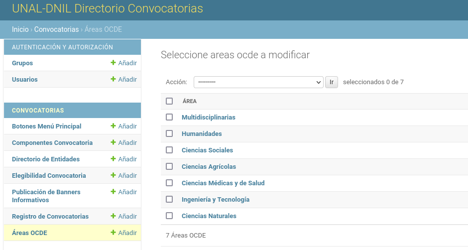

Registro de Convocatorias
-------------------------
Es la funcionalidad principal del directorio, se tiene entonces un listado paginado con las convocatorias actualmente registradas en nuestra base de datos. Es importante notar el estado de la convocatoria en la columna derecha, cuando alguien envía una convocatoria desde el formulario público, esta aparece en el Panel Administrativo como "En Revisión":

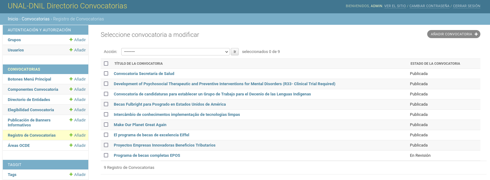

Este es el formulario más extenso del panel administrativo y se apoya en la información registrada desde los otros componentes. 

La primera parte registra la descripción de la convocatoria, su fecha de publicación, su fecha límite de postulación, la página web asociada para los postulantes (recurso externo), y una imagen para su rotación en redes sociales (opcional):

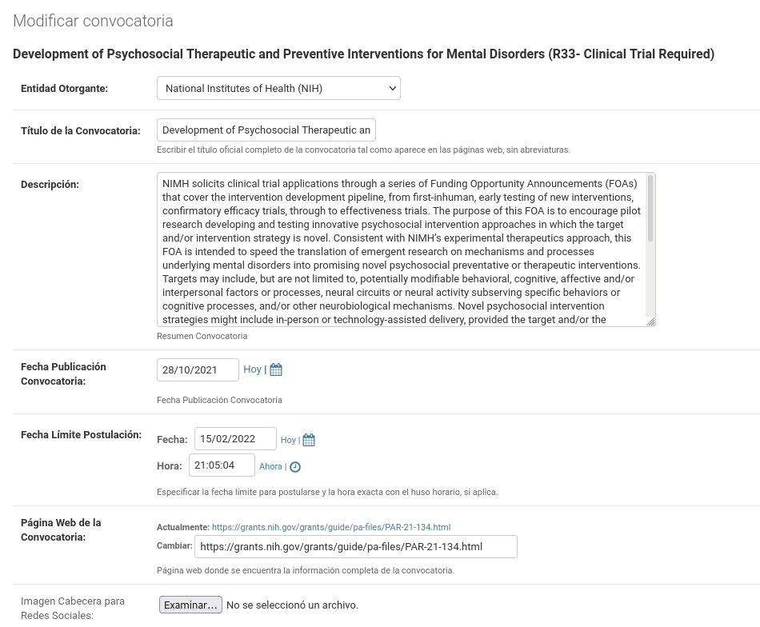

Se incluyen las categorías de caracterización mencionadas anteriormente:

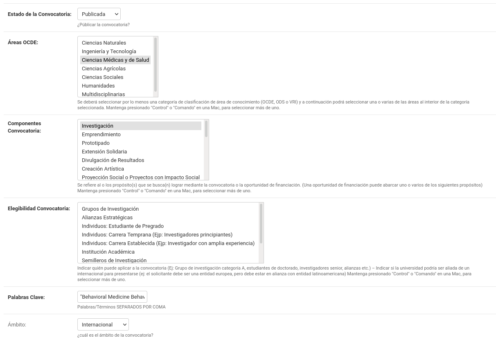

Los montos y descripción del beneficio otorgado:

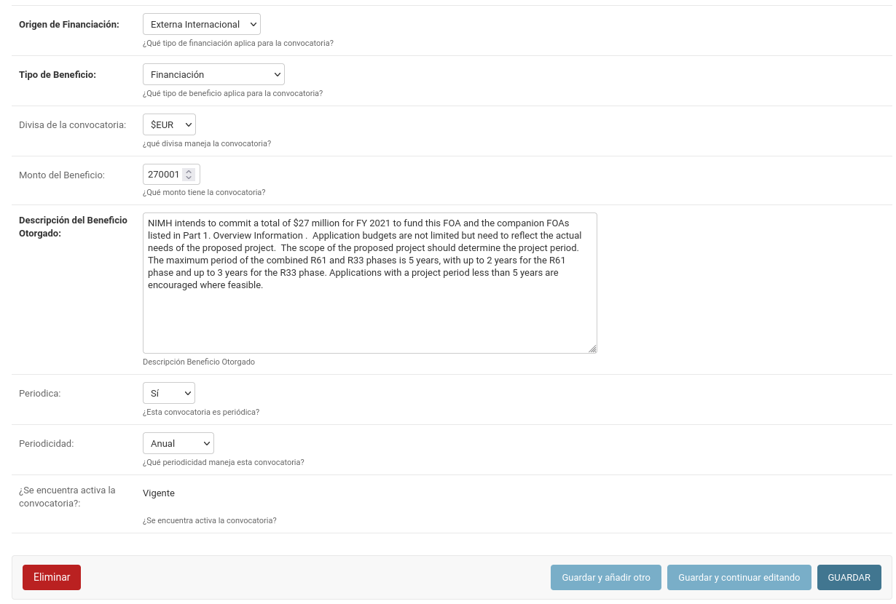

Configuración Enlaces de apoyo
------------------------------
El directorio incluye de manera complementaria, dos bloques para presentar elementos informativos de apoyo, también son configurables por parte de usuario Gestor.

Publicación de Banners informativos
~~~~~~~~~~~~~~~~~~~~~~~~~~~~~~~~~~~
Se pueden tener 1 o varios banners con información relevante al directorio. Cada banner a modo de publicación de noticia, requiere un título, una corta descripción, una url o enlace del recurso al cual queremos llevar al visitante y una imagen de referencia que se utilizará como fondo del banner.

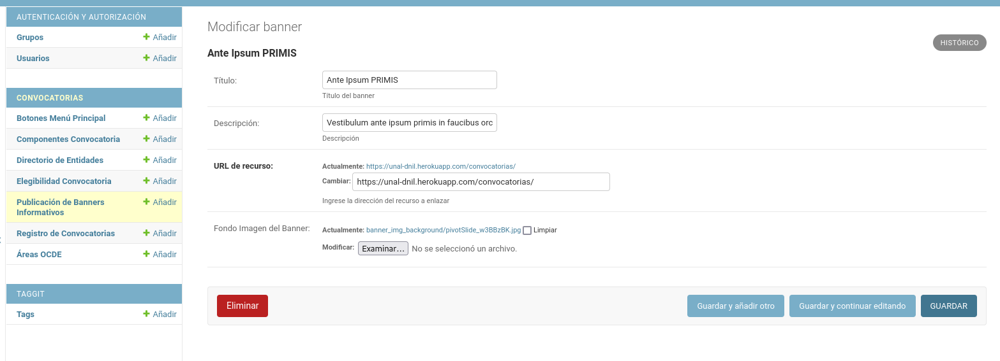

Botones Menú Principal
~~~~~~~~~~~~~~~~~~~~~~
Existen 4 botones principales con recursos informativos estratégicos para el directorio, actualmente buscan ofrecer un acceso al Calendario Institucional de Formación, el Sistema HORUS, la Plataforma PIVOT y el Instructivo de Convocatorias. Si en algún momento sus enlaces cambian, de la misma forma que se hace con los banners, estos se pueden configurar (actualizar la URL de recurso):

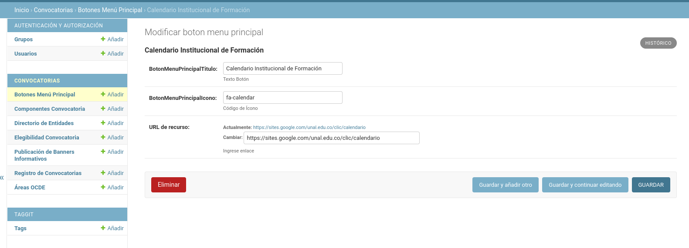
